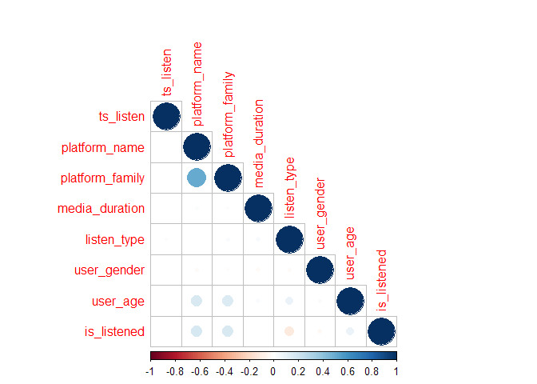

R Notebook
================

``` r
train= read.csv("G:\\PGDBA\\Kaggle\\DSG2017\\train.csv")

str(train) #all integers
```

    ## 'data.frame':    7558834 obs. of  15 variables:
    ##  $ genre_id       : int  25471 25571 16 7 7 7 7 7 7 7 ...
    ##  $ ts_listen      : int  1480597215 1480544735 1479563953 1480152098 1478368974 1478382544 1478338409 1478353709 1479130924 1479214304 ...
    ##  $ media_id       : int  222606 250467 305197 900502 542335 542335 542335 542335 542335 542335 ...
    ##  $ album_id       : int  41774 43941 48078 71521 71718 71718 71718 71718 71718 71718 ...
    ##  $ context_type   : int  12 0 1 0 0 0 0 1 0 1 ...
    ##  $ release_date   : int  20040704 20060301 20140714 20001030 20080215 20080215 20080215 20080215 20080215 20080215 ...
    ##  $ platform_name  : int  1 2 2 0 0 0 0 1 0 1 ...
    ##  $ platform_family: int  0 1 1 0 0 0 0 0 0 2 ...
    ##  $ media_duration : int  223 171 149 240 150 150 150 150 150 150 ...
    ##  $ listen_type    : int  0 0 1 0 0 0 0 1 0 1 ...
    ##  $ user_gender    : int  0 0 1 1 1 1 1 1 1 1 ...
    ##  $ user_id        : int  9241 16547 7665 1580 1812 1812 1812 10325 1812 51 ...
    ##  $ artist_id      : int  55164 55830 2704 938 2939 2939 2939 2939 2939 2939 ...
    ##  $ user_age       : int  29 30 29 30 24 24 24 29 24 28 ...
    ##  $ is_listened    : int  0 1 1 0 1 1 1 1 1 1 ...

``` r
summary(train)
```

    ##     genre_id        ts_listen            media_id        
    ##  Min.   :     0   Min.   :1.000e+00   Min.   :   200058  
    ##  1st Qu.:     0   1st Qu.:1.478e+09   1st Qu.: 13766137  
    ##  Median :     3   Median :1.479e+09   Median : 93806596  
    ##  Mean   :  2245   Mean   :1.479e+09   Mean   : 78396237  
    ##  3rd Qu.:    27   3rd Qu.:1.480e+09   3rd Qu.:126259195  
    ##  Max.   :259731   Max.   :1.481e+09   Max.   :137260128  
    ##     album_id         context_type    release_date      platform_name   
    ##  Min.   :    1976   Min.   : 0.00   Min.   :19000101   Min.   :0.0000  
    ##  1st Qu.: 1255566   1st Qu.: 0.00   1st Qu.:20091231   1st Qu.:0.0000  
    ##  Median : 9525626   Median : 1.00   Median :20141031   Median :0.0000  
    ##  Mean   : 8136169   Mean   : 2.36   Mean   :20113878   Mean   :0.4732  
    ##  3rd Qu.:13292211   3rd Qu.: 2.00   3rd Qu.:20160607   3rd Qu.:1.0000  
    ##  Max.   :14720858   Max.   :73.00   Max.   :30000101   Max.   :2.0000  
    ##  platform_family  media_duration     listen_type      user_gender    
    ##  Min.   :0.0000   Min.   :    0.0   Min.   :0.0000   Min.   :0.0000  
    ##  1st Qu.:0.0000   1st Qu.:  196.0   1st Qu.:0.0000   1st Qu.:0.0000  
    ##  Median :0.0000   Median :  222.0   Median :0.0000   Median :0.0000  
    ##  Mean   :0.2558   Mean   :  231.2   Mean   :0.3069   Mean   :0.3937  
    ##  3rd Qu.:0.0000   3rd Qu.:  254.0   3rd Qu.:1.0000   3rd Qu.:1.0000  
    ##  Max.   :2.0000   Max.   :65535.0   Max.   :1.0000   Max.   :1.0000  
    ##     user_id        artist_id           user_age      is_listened   
    ##  Min.   :    0   Min.   :       1   Min.   :18.00   Min.   :0.000  
    ##  1st Qu.:  899   1st Qu.:    2605   1st Qu.:21.00   1st Qu.:0.000  
    ##  Median : 2738   Median :  194172   Median :25.00   Median :1.000  
    ##  Mean   : 4037   Mean   : 1500740   Mean   :24.31   Mean   :0.684  
    ##  3rd Qu.: 6064   3rd Qu.: 1519461   3rd Qu.:28.00   3rd Qu.:1.000  
    ##  Max.   :19917   Max.   :11447410   Max.   :30.00   Max.   :1.000

-   lots of outliers observed in release date
-   Gender ratio 0.39
-   median age:: 25, max=30
-   avg of 30% songs heard in flow
-   2922 genre ids!, Top 10 genres: 0 (48.5%, guess it means no genre), 7 (12.29%), 10 (3.8%), 25, 14
-   74 context types, (default:0, 42.3%)

-   Platform name:3 types
-   on average a user listens 379 songs (median 197)
-   Number of songs: 452975

``` r
##Correlation matrix
library(corrplot)
```

    ## Warning: package 'corrplot' was built under R version 3.2.3

``` r
cor_mat= cor(train[,c(2,7,8,9,10, 11, 14,15)])
corrplot(cor_mat, type='lower')
```

 \* Nothing significant observed

``` r
library(data.table)
```

    ## Warning: package 'data.table' was built under R version 3.2.3

``` r
train= data.table(train)
df=train[, .N, by="user_id"]
summary(df$N)
```

    ##    Min. 1st Qu.  Median    Mean 3rd Qu.    Max. 
    ##     1.0    66.0   197.0   379.5   495.0  6317.0

``` r
#Average no. of listens per song: 16.68, median=2
df=train[,.N, by=c("media_id", "is_listened")]
summary(df$N[df$is_listened==1])
```

    ##     Min.  1st Qu.   Median     Mean  3rd Qu.     Max. 
    ##     1.00     1.00     2.00    13.97     5.00 15420.00

``` r
#Total number of songs a user listens to

df= train[, .N, by=c("user_id", "is_listened")]
summary(df$N[df$is_listened==1])
```

    ##    Min. 1st Qu.  Median    Mean 3rd Qu.    Max. 
    ##     1.0    39.0   126.0   262.2   333.0  6200.0

``` r
#Number of unique songs a user listens to

df= train[, .(cnt=.N), by=c("user_id", "media_id", "is_listened")][order(user_id)]
df= df[, .N, by=c("user_id", "is_listened")]
summary(df$N[df$is_listened==1])
```

    ##    Min. 1st Qu.  Median    Mean 3rd Qu.    Max. 
    ##     1.0    25.0    73.0   139.2   183.0  2647.0
